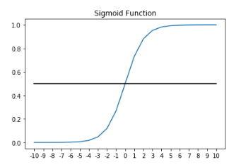
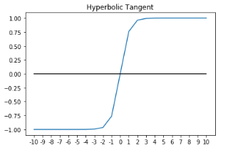
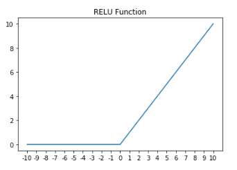
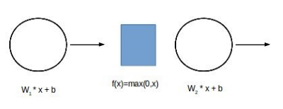
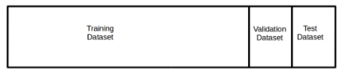

# 1. The deep neural network architectures
* Một mạng có thể có 100 neuron hay thậm chí hàng triệu neuron.

## 1.1. Neurons
* Neuron là một đơn vị trong một neural network.
* Các neuron sẽ sắp xếp thành các layer.
* Chúng ta dùng kí hiệu $n_k^l$ trong đó $l$ là layer mà neuron này thuộc về và $k$ là số lượng neuron nằm trong cùng layer với neuron này.
* Các neuron có hai chức năng chính và chúng làm việc cùng nhau, bao gồm:
  * ***A linear function*** [một hàm tuyến tính].
  * ***Activation function*** [hàm kích hoạt].

### 1.1.1. The neuron linear function
* Output của một linear function là **tổng của các đầu vào** - với mỗi đầu vào được nhân cho một ***coefficient*** [hệ số] tương ứng.
* Các coefficient còn được gọi là ***weights*** [các trọng số] của neural network.
* Ví dụ, cho một neuron với input lần lượt là $x_1, x_2, x_3$ và output là $z$, lúc này linear function của neuron là:
  $$z = x_1\theta_1 + x_2\theta_2 + x_3\theta_3 + b \tag{1.1.1.1}$$
  * Với $\{\theta_1, \theta_2, \theta_3\}$ là weights (hoặc coefficients) mà chúng ta cần tìm và $b$ được gọi là **bias**.

### 1.1.2. Neuron activation functions
* Dưới đây ta có activation function $sigmoid$, định nghĩa như sau:
  * Công thức:
  
    $$sigmoid(z) = \dfrac{1}{1 + e^{-z}} \tag{1.1.2.1}$$

  * Giá trị của hàm $sigmoid(z) \in (0, 1)$.
    

    
       
      _Hình 1.1.2.1_
  
    

* Một activation function khác là $tanh$, định nghĩa như sau:
  * Công thức:
  
    $$tanh(z) = \dfrac{e^z - e^{-z}}{e^z + e^{-z}} \tag{1.1.2.2}$$

  * Giá trị của hàm $tanh(z) \in (-1, 1)$.
    

      
      _Hình 1.1.2.2_

    

  * Hàm $tanh$ thường được ưa dùng hơn $sigmoid$ vì nó khắc phục được một hiện tượng là ***vanishing/exploding gradient*** [gradient biến mất/bùng nổ] - vanishing gradient khiến cho network hội tụ chậm và với $tanh$, network có xu hướng hội tụ nhanh hơn là so với $sigmoid$ _(tìm hiểu sau)_, tuy nhiêm vẫn không nhanh bằng $ReLu$.

* Activation function $ReLu$, định nghĩa như sau:
  * Công thức:
    $$f(z) = \max{(0, z)} \tag{1.1.2.3}$$

    

      
      _Hình 1.1.2.3_

    

  * $ReLu$ có ưu điểm là dễ tính toán và khắc vấn đề vanishing gradient, nhược điểm của nó là nếu $f(z) = 0$ thì chúng ta không thể tính được đạo hàm cấp một tại đây (đạo hàm tại $0$ là không xác định, tức không có đạo hàm). 
  
## 1.2. The loss and cost functions in deep learning
* Mọi machine learning model đều có một ***cost function*** [hàm chi phí] (còn có những tên khác là loss function, error function) - chức năng của nó là dùng để đo model của chúng ta "hiểu" training data như thế nào.
* Dưới đây ta có một cost function $J$ như sau:
  $$J = \dfrac{1}{2m} \sum_{i = 1}^m (\widehat{y} - y)^2 \tag{1.2.1}$$

## 1.3. The forward propagation process
* **Forward propagation** là quá trình chúng ta cố gắng dự đoán **target variable** bằng cách sử dụng các **feature** của một **observation**.
* Giả sử một neural network gồm hai layer. Theo phương pháp forward propagation, chúng ta sẽ bắt đầu với các feature của observation đầu tiên $\{x_1, x_2,...,x_n\}$ và sau đó chúng ta nhân giá trị của các feature này cho các coefficient tương ứng của chúng trong layer 1, sau cùng chúng ta cộng giá trị bias vào từng neuron.
* Tiếp theo, các kết quả trên của từng neuron sẽ đi qua một activation function. Quá trình này sẽ lặp đi lặp lại cho đến cuối neural network - nơi chúng ta sẽ đữa ra kết quả dự đoạn.
* Hình dưới đây biểu diễn quá trình một neural network làm việc:
  

    
    _Hình 1.3.1_
  
  

## 1.4. The back propagation function
* Trong tập training data, chúng ta biết được ***actual value*** [giá trị thực] của từng ***data point*** [điểm dữ liệu]. Actual value này chính là biến mà ta muốn model dự đoán, lúc này ta còn gọi nó là **target variable**, kí hiệu là $y$.
* Sau khi ta hoàn thành quá trình forward propagation, model sẽ đưa ra kết quả mà nó dự đoán cho từng data point, kí hiệu là $\widehat{y}$.
* Khi chúng ta có $y$ và $\widehat{y}$, chúng ta có thể tính được cost function. Ta có thể gọi ngắn gọn cost function là hàm $loss$.
* Để model thực sự "học" trong neural network, thì ta phải có một ***error signal*** [tín hiệu lỗi] được truyền ngược qua từng layer - bắt đầu từ layer cuối cùng đến layer đầu tiên. Error signal được dùng để cập nhật lại các weights từ đó model có thể dự đoán chính xác hơn.
* Về toán học, ta muốn tối thiểu hóa cost function càng thấp càng tốt - quá trình tối thiểu hóa cost function còn được gọi là **gradient descent**.

* Gradient là đạo hàm riêng của error function đối với từng weight trong network. Qua từng layer, các gradient của các weight được tính. Khi các gradient được tính thì sau đó ta sử dụng quy tắc **chain rule** cùng với các gradient này để tính toán gradient descent
* Gradient descent sẽ được lặp lại và cập nhật các weight cho đến khi loss function đạt giá trị nhỏ nhất, đây la công thức cập nhật các weight theo loss function.
  $$\theta = \theta - \alpha \dfrac{\partial J}{\partial \theta} \tag{1.4.1}$$
  
  * Thuật toán gradient descent sẽ nhân các gradient $\dfrac{\partial J}{\partial \theta}$ cho ***learning rate*** [tốc độ học] - kí hiệu là $\alpha$ sau đó lấy giá trị hiện tại của các weight trừ cho tích trên.
  * Learning rate ở đây là một **hyperparameter** _(tìm hiểu sau)_.

## 1.5. Stochastic and minibatch gradient descents
_(Tìm hiểu thêm bên ngoài)_

# 2. Optimazation algorithms for deep learning
* Gradient descent thường được dùng để tối ưu hóa các weight trên neural network, tuy nhiên nó cũng là cơ sở cho nhiều thuật toán tối ưu khác ra đời. Phần tiếp theo sẽ nói sơ qua.

## 2.1. Using momentum with gradient descent
* **Gradient descent with momentum** là một biến thể của phương pháp gradient truyền thống nhằm tăng tốc độ hội tụ, công thức như sau:
  $$v_t = \beta v_{t - 1} + (1 - \beta) \times \left ( \dfrac{\partial J}{\partial \theta} \right )^2 \tag{2.1.1}$$
  $$\theta = \theta - v_t \tag{2.1.2}$$
  * Thông thường, người ta hay khởi tạo $\beta = 0.9$ và đây không phải là một hyperparameter nên cần thay đổi giá trị của $\beta$ trong quá trình học.

## 2.2. The RMSProp algorithm
* **RMSProp** cũng là một biến thể của gradient descent giúp làm tăng tốc quá trình hội tụ, công thức như sau:
  $$\theta = \theta - \alpha \dfrac{\partial J / \partial \theta}{\sqrt{v_t}} \tag{2.2.1}$$
  * Thuật toán này giúp giảm dao động ở những hướng có $v_t$ lớn.

## 2.3. The Adam optimizer
* **Adam** là một thuật toán tối ưu hóa là thuật toán tối ưu hóa tốt nhất và thường được lựa chọn đầu tiên khi giải quyết các bài toán neural network. Nó kết hợp cả hai yếu tố là momentum và RMSProp, cụ thể như sau:
  $$\text{grad} = \dfrac{\partial J}{\partial \theta} \tag{2.3.1}$$
  $$m_t = \beta_1 m_{t - 1} + (1 - \beta_1) \text{grad} \tag{2.3.2}$$
  $$v_t = \beta_2 v_{t - 1} + (1 - \beta_2) \text{grad} \tag{2.3.3}$$
  $$\theta = \theta - \alpha \dfrac{m_t}{\sqrt{v_t + \epsilon}}$$
  * Với $\epsilon$ là một giá trị cực nhỏ để tránh tình huống chia cho $0$.

# 3. Deep learning frameworks
## 3.1. What is TensorFlow?
_(Vô sách đọc)_
## 3.2. What is Keras?
_(Vô sách đọc)_
## 3.3. Popular alternatives to TensorFlow
_(Vô sách đọc)_

## 3.4. GPU requirements for TensorFlow and Keras
_(Vô sách đọc)_

## 3.5. Installing Nvidia CUDE Toolkit and cuDNN
_(Vô sách đọc)_

## 3.6. Installing Python
_(Vô sách đọc)_

## 3.7. Installing TensorFlow and Keras
_(Vô sách đọc)_

# 4. Building datasets for deep learning
* ***Deep neural network*** [mạng neuron học sâu] trên thực tế rất là phức tạp. Giả sử ta có một network bao gồm:
  * 100 input.
  * Hai **hidden layer** với mỗi layer bao gồm 30 neuron
  * Và một logistic ouput layer.
* Vậy với các con số trên, thì network này sẽ có $100 \times 30 + 30 \times 30 + 30 = 3930$ ***learnable parameters*** [các tham số cần học] cũng như các hyperparameter cần thiết cho ***optimization*** [tối ưu hóa].
* Một ***convolutional neural network - CNN*** [mạng neuron tích chập] lớn sẽ có đến hàng trăm triệu learnable parameter. Với nhiều learnable parameter như vậy sẽ khiến cho model mạnh mẽ hơn nhưng đôi khi lại gây ra **overfitting**. 

## 4.1. Bias and variance errors in deep learning
* **Bias error**: là lỗi do model đưa vào. Ví dụ tập training data của ta có một mối quan hệ non-linear giữa input và output, nhưng ta lại đi xây dựng một linear model.
* **Variance error**: lỗi này xảy ra do **tính ngẫu nhiên** của training data. Khi chúng ta build model, chúng ta cố gắng tìm ra các learnable parameter sao cho nó khớp với training data, tuy nhiên nếu các learnable parameter này quá khớp với training data thì nó gây ra overfitting, từ đó làm mất đi **tính tổng quát** của model.
* Trong các model machine learning, chúng ta cố gắng giảm bias error đồng thời variance error càng thấp càng tốt. Tuy nhiên với deep neural network, chúng ta có thể độc lập giảm hai độ lỗi này.

## 4.2. The train, val, and test datasets
* Khi chúng ta có một dataset, chúng ta sẽ chia nó thành ba phần là **train**, **val** và **test**. Ba phần này độc lập lẫn nhau và được chọn ngẫu nhiên từ dataset.
  

    
  _Hình 4.2.1_

  

* **Training data** được dùng để xây dựng network.
* **Val data** được dùng để tìm ra các hyperparameter và đo lường overfitting.
* Mỗi khi ta kết thúc một **epoch** (là khi mà network đã quan sát hết tất cả các data point trong training data), chúng ta sẽ sử dụng val data cho network dự đoán. Kết quả được network dự đoán trên val data có thể được sử dụng để khắc phục overfitting và cho chúng ta biết khi nào chúng ta nên kết thúc quá trình học của network. Việc sử dụng val data để cải thiện network như trên được gọi là phương pháp **Hold-Out Validation** tham khảo từ [**The Elements of Statistical Learning by Hastie and Tibshirani**](https://web.stanford.edu/~hastie/ElemStatLearn/).
* Test data được sử dụng khi quá trình học của network đã hoàn tất - được dùng để đánh giá ***performance*** [hiệu suất] của model trên data mà model **chưa từng được nhìn thấy**.
* Người ta thường dành ra từ 10% đến 20% observation trên dataset cho val và test data.

## 4.3. Managing bias and variance in deep neural networks
* Bây giờ chúng ta sẽ tìm hiểu cách kiểm soát bias error và variance error trong deep neural network.
  * **High bias**: Network với bias error cao sẽ có tỉ lệ lỗi cao khi dự đoán trên training data. Lúc này model không thể điều chỉnh các learnable parameter để khớp với training data. Để giảm bias error, chúng ta cần thay đổi kiến trúc của network. Chúng ta có thể thêm vào vài layer, neuron hoặc thêm vào cả hai.
  * **High variance**: Một network với bias error thấp sẽ khớp với training data. Tuy nhiên nếu tỉ lệ lỗi val data cao hơn trên test data thì lúc này overfitting xảy ra trên training data. Có hai cách để giảm variance error là:
    * Thêm data vào training data: Cách làm này tuy đơn giản nhưng trên thực tế không phải lúc nào ta cũng có đủ khả năng, chi phí hoặc thời gian để có data mới.
    * Sử dụng kĩ thuật **regularization** cho network: Có nhiều kĩ thuật thuật regularization như **L2 regularization**, **Dropout** và **Batch normalization** _(tìm hiểu sau)_.

## 4.4. K-Fold cross-validation
* Vậy tại sao chúng ta dùng phương pháp Hold-Out Validation thay vì K-Fold cross-validation cho deep neural network. Đào tạo một deep neural network là một hoạt động rất tốn kém và nếu ta đã biết về machine learning K-Fold cross-validation là một kĩ thuật đòi hỏi nhiều thời gian và trong bối cảnh của deep neural network thì không thực tế lắm.
* Tuy nhiên, Keras cũng cung cấp cho ta một **scikit-learn interface** cho phép ta tích hợp các model của Keras vào bên trong **scikit-learn pipeline**. Tức chúng ta hoàn toàn có thể sử dụng phương pháp K-Fold cross-validation, hoặc cao cấp hơn là **Stratified K-Fold** hay thậm chí áp dụng **grid search** với K-Fold nếu bạn rãnh. Tuy nhiên tôi không rãnh như vậy, nên tôi chỉ tập trung sử dụng phương pháp Hold-Out Validation thôi.